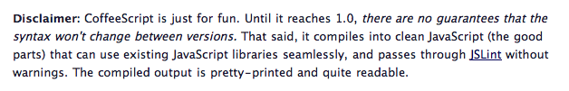

!SLIDE full-page

# 

## syntax matters

!SLIDE smbullets incremental

## **About Me**

* Jacques Crocker
* a "rails jedi"
* primarily focused on frontend dev

!SLIDE smbullets incremental

## *recently...*

* built http://scrabb.ly for node knockout
* massively multiplayer scrabble board
* now known as wordsquared.com (f*&#ing hasbro)
* frontend code 100% coffeescript

!SLIDE bullets incremental

##  **Confession:**
* My favorite language is **Ruby**
* What I code in most is **Javascript**
* Javascript has always bugged me

!SLIDE bullets

* I love what javascript can do
* I just don't like the syntax of the language
* It's a tad ugly (arguable)

!SLIDE smbullets incremental

## **CoffeeScript** to the rescue

* Not *that* different than javascript

* Combines the best aspects of Ruby and Python

* Whitespace sensitive for code organization

* Compiles into javascript

!SLIDE code smaller

    @@@ruby

    # example code (from scrabb.ly)...

    # build query from playTiles
    query = {}
    _(Board.playTiles).each (tile, coords) ->
      wildcard = $(tile).dataset('wildcard')
      coords = coords.split(",")

      # add tiles onto query (sent to server)
      query.tiles.push
        letter: $(tile).dataset('letter')
        wildcard: (wildcard == "true")
        x: parseInt(coords[0], 10)
        y: parseInt(coords[1], 10)

!SLIDE center

## Douglas Crockford likes it!

!SLIDE

### "One of my favorites along those lines is a new little language called CoffeeScript, which takes the good parts -- not even all of the good parts, but a nice little language -- and comes up with groovy new syntax for it, which is minimal. It's almost like dandelions: little fluffs of programs that do everything that conventional JavaScript programs do. You can't do anything in that language that you can't do in JavaScript, so it's all cosmetic. I don't know if all or much of that will find its way into JavaScript, because I'm not sure there's enough of a payoff there. But just as an experiment, as a design exercise, I think it's a brilliant piece of work. I'm excited to see stuff like that happening. "

### -- Douglas Crockford (author of "Javascript: The Good Parts")

!SLIDE center

## **Just for Fun**

!SLIDE center

## Nope, **not** just for Fun

!SLIDE bullets incremental

## For **Serious Business**??

* Used by 37 Signals, Github, many more
* Still pre 1.0, but it's getting very close
* Some syntax changes coming for 1.0, so be cautious

!SLIDE center

# The Killer Features

!SLIDE center

# #1: **Strings**

!SLIDE code

    # Multiline Strings
    html = """
           <strong>
             cup of coffeescript
           </strong>
           """

!SLIDE code

    @@@ruby
    # String Interpolation

    author = "Wittgenstein"
    quote  = "A picture is a fact. -- #{author}"

!SLIDE code

    @@@ruby
    # Interpolation works on regexes too

    sep   = "[.\\/\\- ]"
    dates = /\d+#{sep}\d+#{sep}\d+/g

!SLIDE center

# #2: **Classes**

!SLIDE code smaller

    @@@ruby
    # Create a class
    class Animal
      constructor: (@name) ->

      move: (meters) ->
        alert @name + " moved " + meters + "m."

    # Inherit from Animal (allows use of super)
    class Snake extends Animal
      move: ->
        alert "Slithering..."
        super 5

    class Horse extends Animal
      move: ->
        alert "Galloping..."
        super 45

    sam = new Snake "Sammy the Python"
    tom = new Horse "Tommy the Palomino"

    sam.move()
    tom.move()

!SLIDE center

# **The Basics**

!SLIDE code

    @@@ruby
    # Assignment:
    number   = 42
    opposite = true

    # Conditional:
    if happy and knowsIt
      clapsHands()
      chaChaCha()
    else
      showIt()

    # Single line Conditional:
    date = if friday then sue else jill

!SLIDE center

# Beautiful Object Syntax

!SLIDE code

    @@@ruby

    kids =
      brother:
        name: "Max"
        age:  11
      sister:
        name: "Ida"
        age:  9

!SLIDE code

    @@@ruby
    # jquery ajax call
    $.ajax
      url: "/drag"
      type: "POST"
      contentType: 'application/json'
      data:
        game: Game.gameId()
        tiles: serverTileCoords

!SLIDE center

# Beautiful Function Syntax

!SLIDE code

    @@@ruby
    # Functions:
    square = (x) -> x * x

    # Multiline:
    square = (x) ->
      x * x

!SLIDE code

    @@@ruby

    # common jquery code
    $('.nav-item').bind
      click: (e) ->
        console.log("clicked")

      mouseover: (e) ->
        console.log("mouseover")

      mouseout: (e) ->
        console.log("mouseout")

!SLIDE center

# Smart variable scoping

(no more forgetting to type var!)

!SLIDE code

    @@@ruby
    # lexical scoping
    outer = 1
    changeNumbers = ->
      inner = -1
      outer = 10
    inner = changeNumbers()

!SLIDE bullets incremental

# BTW: No global variables!

* Use: `window.myvariable = "something"`

!SLIDE center

# Safely use jQuery

    $ = jQuery

!SLIDE code

    @@@javascript

    // yeah, we dont need to do this anymore
    (function($) {

      // my jquery code

    })(jQuery);

!SLIDE center

# Array Comprehension

!SLIDE code smaller

    @@@ruby
    lunch = eat food for food in ['toast', 'cheese', 'wine']

    # Naive collision detection.
    for roid in asteroids
      for roid2 in asteroids when roid isnt roid2
        roid.explode() if roid.overlaps roid2

    # works with ranges
    countdown = num for num in [10..1]

    deliverEggs = ->
      for i in [0...eggs.length] by 12
        dozen = eggs[i...i+12]
        deliver new eggCarton dozen

!SLIDE center

# BTW, everything is an expression

implicit return statement for the last line of every function

!SLIDE code

    @@@ruby
    grade = (student) ->
      if student.excellentWork
        "A+"
      else if student.okayStuff
        if student.triedHard then "B" else "B-"
      else
        "C"

    eldest = if 24 > 21 then "Liz" else "Ike"

!SLIDE center

# More Goodies

!SLIDE code

    @@@ruby

    # existential operator (checks for undefined and null)

    name = "Joe Blow"
    showErrors() unless name? and email?

    # sets email if it doesnt exist
    email ?= "joe@blow.com"

!SLIDE code

    @@@ruby
    # is
    launch() if ignition is on

    # isnt
    volume = 10 if band isnt SpinalTap

    # unless
    letTheWildRumpusBegin() unless answer is no

    # in
    winner = yes if pick in [47, 92, 13]

!SLIDE bullets incremental

# Get it installed...

* via Homebrew

    brew install coffee-script

* via NPM (node)

    npm install coffee-script

* Manually (easy)

    http://coffeescript.org/#installation

!SLIDE bullets

# How to use it:

* Compile to js: `coffee myfile.coffee`

* Watch a folder: `coffee --watch .`

* Interactive: `coffee -i`

!SLIDE center

## Thanks!

### Learn more at http://coffeescript.org
